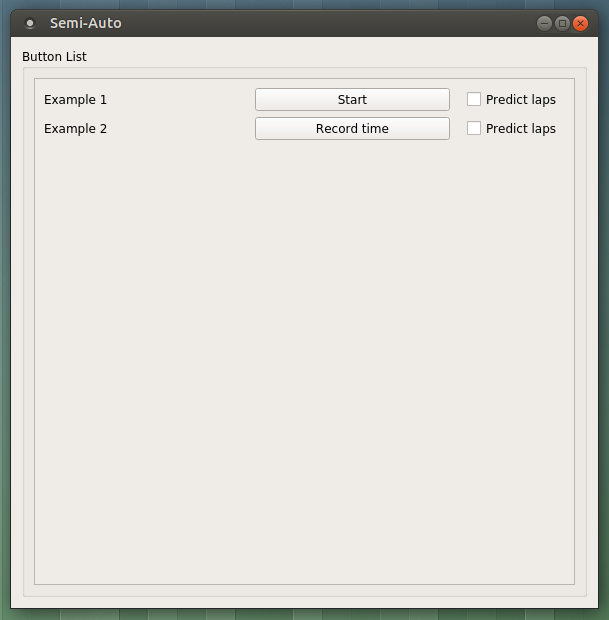

# User manual

## Running the program

After installing the `conda` environment, it will be necessary to activate the environment before running.

### On Windows

From a Command Prompt (or Anaconda's "Anaconda Prompt"), run

    activate "timer-utility"
	
### On macOS and Linux

From a terminal, run

	source activate "timer-utility"
	
Once the environment has been activated, the program may be run using `python` from the root directory of the repository. Depending on your system, the command may look like one of the following:

	python3 -m src.main

or 

	python -m src.main

## Using the program

Once the program starts, a GUI similar to the one below should appear.

From this screen, existing data may be loaded from the **File** menu.

Currently, the **Open**, **Save**, and **Save as** actions work correctly and can be used to save or load lap data files in a CSV format.

### Adding cars to the table

Upon opening the application, it may become apparent that no cells in the Lap Table can be editted immediately. This is intentional; before any lap data can be entered, the cars to be tracked must first be added to the table.

A car may be added to the table through the **Edit** menu by selecting **Edit** > **Add Car**. This action will display a dialog prompting for information about the car to be added.

Once a car is added, the Team name associated with the car will appear in the header of one of the columns. At that point, lap data may be entered into the column using one of the methods described in **Adding and editing lap data** below.

Cars may also be added without the menu. Double clicking any cell in the leftmost column unassigned to a car will produce the same **Add Car** dialog accessible from the **Edit** menu.

### Adding and editing lap data

Data can be input via two modes, Semi-Auto Widget or Manual Table Entry.

#### Manual lap entry

The simplest way of entering lap data is by entering the elapsed times directly into the table. All filled rows in a column are editable. This allows changing of previously entered lap times.

Additionally, the cell immediately below the last filled cell in a column is editable. This allows appending of a new lap time for a car. If no lap times appear in the column, the first cell the column will be editable.

The lap times entered into the cells in the table are expected to be in the format `%H:%M:%S.%m`, where `%H` represents the number of hours, `%M` represents the number of minutes, `%S` represents the number of seconds, and `%m` represents the number of milliseconds. The milliseconds, hours, and minutes are optional, so the time entered may be given in the format, `%M:%S`, for example.

#### Semi-automatic lap entry

Laps may also be entered into the table semi-automatically through the use of buttons which simply record the latest lap time based on previous times in the table.

The Semi-Automatic mode may be accessed by opening **Semi-Auto** through the **View** menu. 

As cars are added to the table, buttons corresponding to each team are added to the Semi-automatic mode window.

To begin recording times for car using the Semi-automatic mode, click the **Start** button for the car. This will begin the first lap for the car. Once the lap has been completed, clicking **Record time** will add the elapsed time to the table and begin the next lap for the car.
